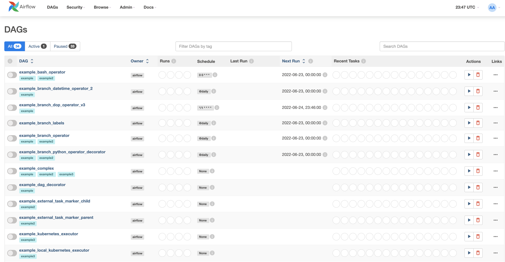
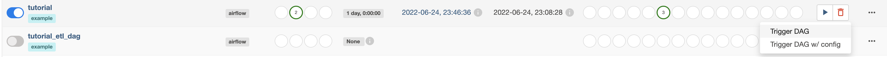
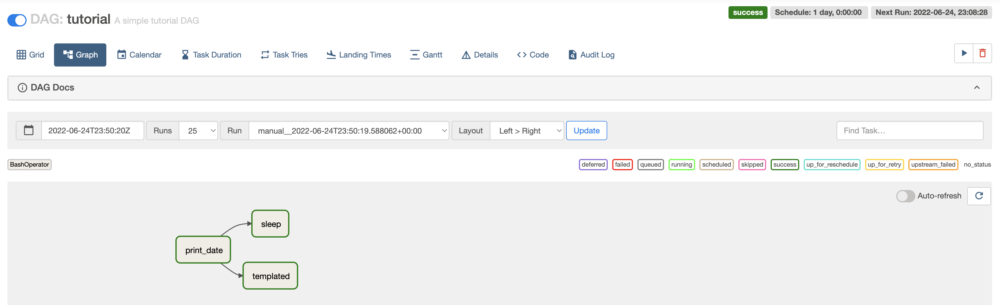
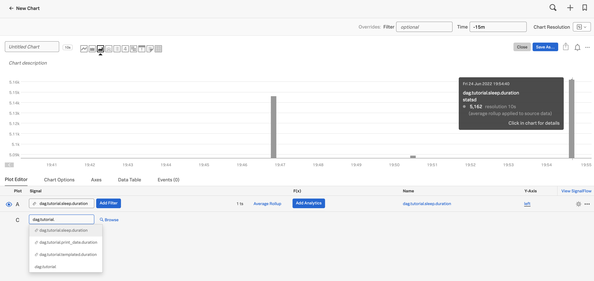
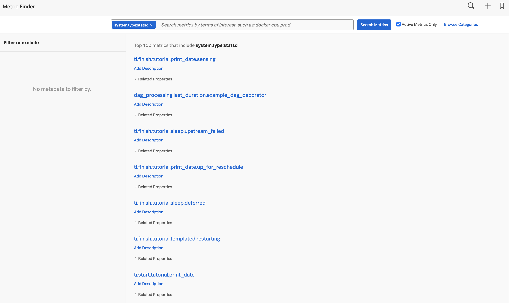

# airflow

This example uses docker and docker-compose to show how the statsd integration can be used to collect metrics.

## Pre-requisites
You need docker and docker-compose to run this example.

In addition if you get an error when running the initialization step that complains about ```docker-credential-desktop not installed``` then try editing ```~/.docker/config.json``` and mchange ```credsStore``` to ```credStore```. This worked for me.

[Source](https://cri.dev/posts/2020-07-06-How-to-solve-Docker-docker-credential-desktop-not-installed-or-not-available-in-PATH/)

## To setup (Set your token and realm below)
```
export SPLUNK_ACCESS_TOKEN=YourToken
export SPLUNK_REALM=YourRealm
git clone https://github.com/billg-splunk/splunk-metrics-oc.git
cd splunk-metrics-oc/airflow
mkdir -p ./dags ./logs ./plugins
echo -e "AIRFLOW_UID=$(id -u)" > .env
docker-compose up airflow-init
```

## To run (set the token and realm again if this is a new session)
```
export SPLUNK_ACCESS_TOKEN=YourToken
export SPLUNK_REALM=YourRealm
docker-compose up
```

## Results
You can find the GUI by going to http://localhost:8080. The login is ```airflow```/```airflow```.



You can enable the ```tutorial``` and then run it with "Trigger DAG".



The tutorial DAG looks like the following:



You can see details of the runs by looking for the metrics:



You can find other metrics of type: statsd:



## Notes
In this example, the prefix ```airflow``` was stripped off of all the metrics. This is not required.
