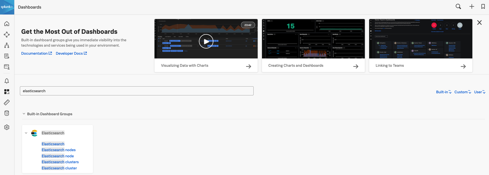
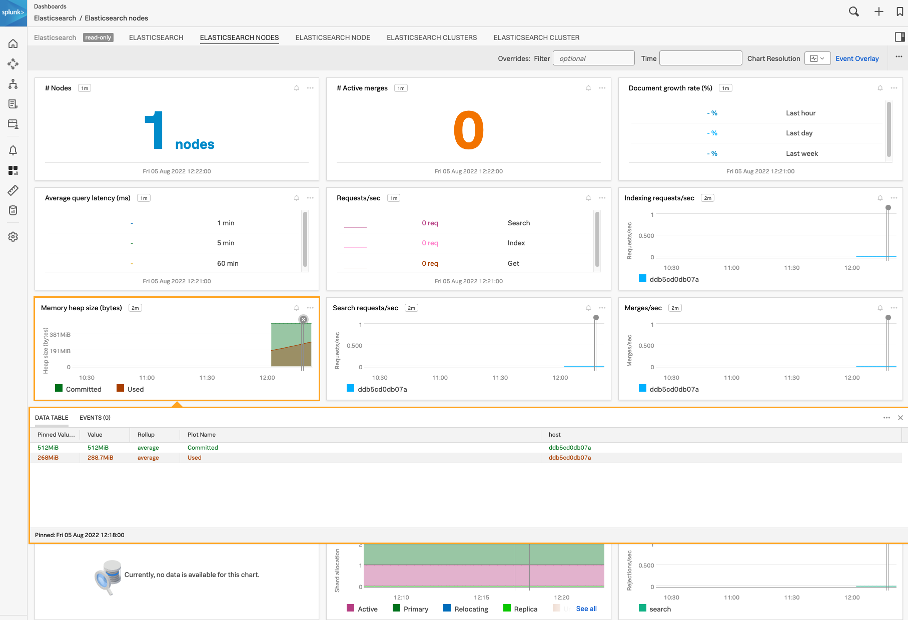

# Elastic Search

This example uses docker and docker compose to show Elastic Search dashboards.

## Pre-requisites
You need docker and docker compose to run this example.

## To setup (Set your token and realm below)
Edit the ```.env``` file and specify your realm and token

## To run
```
./start.sh
```

## To stop
```
./stop.sh
```

## Results
This should create the dashboard group for Elastic Search:


Example Dashboard:


By default there is nothing going on in this cluster, so additional configuration is needed to see real data.

In addition there is also an integration to [Elasticsearch Query](https://docs.splunk.com/Observability/gdi/elasticsearch-query/elasticsearch-query.html) that can also be incorporated for additional metrics.

