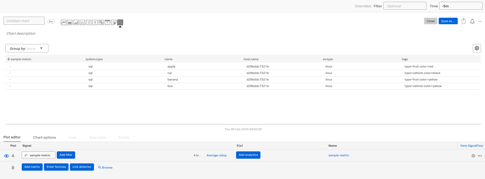

# mssql

This example uses Docker and an mssql install to demonstrate how the mssql monitor can be used.

In part 2 we add steps to add a sample table with data and then run a custom sql query.

In part 3, for situations where you cannot change the query (example: stored procedure) we will add a processor that can split one of the attributes into multiple dimensions.

NOTE: In production you should not use an admin account with full read/write/modify privileges. This merely serves as an example.

## Prerequisites
* Docker (and compose)

## Part 1: Basic Collection

* Edit `.env` and supply your realm and token
* Run `./run.sh`

### Verify Results
* Login to Splunk Infrastructure
  * Navigate to **Dashboards**, Search for **Microsoft SQL Server** and click on **Microsoft SQL Servers**

## Part 2: Adding custom table and querying it

For parts 2 and 3 we will manually hop onto the container and add a sample table with data. There are better ways to do this (volumes to persist the data, automatically running the data initialization, etc.) but we will do this manually so it's very clear what is happening.

* Run `./stop.sh`
* Edit `docker-compose.yaml` and change the config file
  * `SPLUNK_CONFIG=/config/sqlserver.yaml`
  * to
  * `SPLUNK_CONFIG=/config/sqlserver2.yaml`
* Run `./run.sh`
* Our query will fail until we add the data
* Running the following command will give you a shell in the sql server system:
```bash
docker exec -it $(docker ps | grep mssql-db | sed 's/^\([^ \t]*\)[ \t].*/\1/') "bash"
```
  * If for some reason that didn't work, simply run `docker exec -it <container-id> "bash"`
* Inside the container, run the following at the bash prompt
```bash
/opt/mssql-tools/bin/sqlcmd -S localhost -U SA -P Test@12345
```
* And finally run these commands to create the database, table, and data. You may need to type GO and hit enter for each section.
```sql
CREATE DATABASE MySample;
GO

USE MySample;
GO

CREATE TABLE tblSample (id INT, name NVARCHAR(50), quantity INT, tags NVARCHAR(100));
GO;

INSERT INTO tblSample VALUES (1, 'banana', 5, 'type=fruit color=yellow');INSERT INTO tblSample VALUES (2, 'apple', 10, 'type=fruit color=red');INSERT INTO tblSample VALUES (3, 'car', 10, 'type=vehicle color=black');INSERT INTO tblSample VALUES (4, 'bus', 1, 'type=vehicle color=yellow');
GO
```

The result should be that this metric now appears in the system, with name and tags as dimensions:


## Part 3: Adding a processor to split these tags

In this part we will add a processor so that each tag is a dimension. There are many ways to do this but in this case we will simply parse the two tags we have (type and color).

Follow the same steps as part two but use `SPLUNK_CONFIG=/config/sqlserver3.yaml`.

